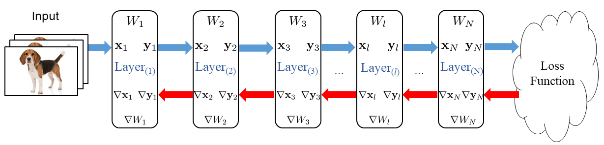
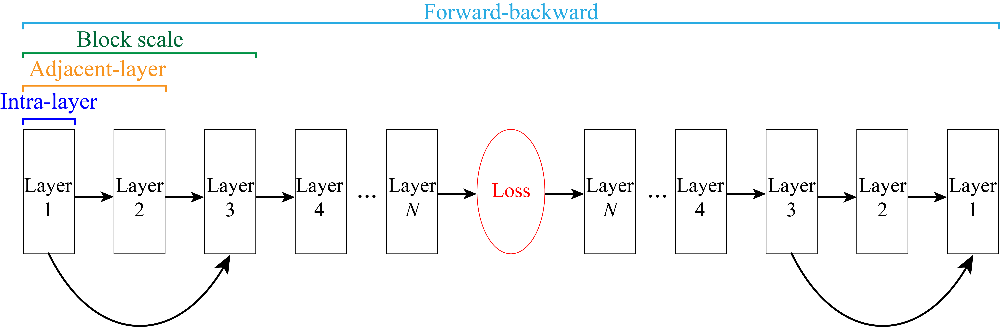

- toc 
{:toc}

# Background
Deep Neural Networks (DNNs) have been proving the effectiveness in various computing fields.
Many hardware designs combine a small on-chip cache with large off-chip memories to prevent expensive memory access.
With the progress of technology, hardware designers are having more and more design choices.
Therefore, a tool to estimate the tradeoffs among all memory design parameters is thus import.

However, existing tools are limited to 
i. inference only
ii. image classification networks as the primary benchmark for evaluation
iii. only modeling the dataflow within the convolutional layers, neglecting other layers like batch normalization and activation.
We believe that training networks is still important to extend the applications and develop more efficient model structure, and layers except convolutional and fully-connected layers still play an non-negligible role in DNN training

This work is proposed to resolve the aforementioned issues.

# Data Reuse

{:class="card-img"}
*Tensors involved in a DNN training iteration*

- $$X$$: Input tensor (=output tensor of the previous layer)
- $$Y$$: Output tensor (=input tensor of the next layer)
- $$W$$: Weight
- $$\nabla X$$: Gradient of input tensor (=input tensor of the next backprop layer)
- $$\nabla Y$$: Gradient of output tensor (=output tensor of the previous backprop layer)
- $$\nabla W$$: Gradient of weight

{:class="card-img"}
*Reuse scope in DNN training*

This work mainly focuses on inter-layer reuse, which includes *adjacent-layer reuse*, *block-scale reuse*, and *forward-backward reuse*.

# Methodology

---
[Thesis link](/files/mike_tsai_ms_thesis.pdf)
