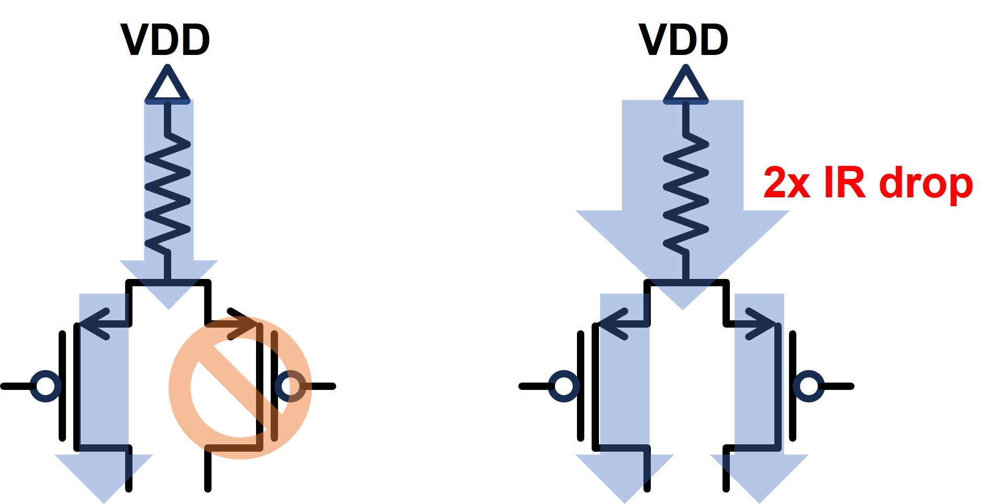

- toc 
{:toc}

Disclaimer: The tool is TSMC's proprietary and the author can only disclose part of the information.

# Background and Design Consideration
## The need for a fast delay estimation tool
As reinforcement-learning-based methods become more and more popular, the need for a fast scoring method emerges.
The time required for evaluating a circuit is directly related to the efficiency of the RL agent.

## Scope of this work
This tool is focused on standard cells, assuming the circuit including only PMOS, NMOS, and parasitic resistors/capacitors.

---
# System architecture
This work integrates two artifacts from other teams, LDE estimator, and pre-characterization lookup table, into a standalone program composed of graph and linear algebra algorithms.

## LDE Estimator
Layout Dependent Effect (LDE) plays a critical role in advanced node.
The drain current of a transistor can vary up to 40% arising from LDE.
TSMC's spice team developed a *LDE Estimator* with Python interface to estimate the DC performance of individual transistors in tens of milliseconds.

My duty is to integrate this Python package into my program, which is written in C++.

## Pre-characterized Lookup Table (Pre-K LUT)
The most time-consuming part in SPICE simulation is transient analysis.
In order to outperform simulators in computation time, we need another method to replace transient analysis.
In this tool, we perform a pre-characterization to study the relationship between DC performance and transient counterpart.
And we use a 2-dimensional (input slew and loading capacitance) lookup table to map DC current to its effective average current in transient analysis.

Combining the LUT with LDE estimator, <u><b>we can estimate the pre-layout transient performance of individual transistors or some targeted topologies</b></u>.

## Channel Connected Component (CCC) Divider
The algorithm for this part is inspired by [FROSTY: a fast hierarchy extractor for industrial CMOS circuits](https://ieeexplore.ieee.org/document/1257891).
Using the alrorithm proposed in the paper, we can divide a standard cell into several stages, and construct a graph to represent the connection between these stages.

<u><b>The purpose of this step is to divide a complex cell into several targeted topologies that are covered in pre-K</b></u>.

## Graph Traversal
Graph theory and graph algorithms are the centerpiece of this tool.
A standard cell is first divided into several stages (channel connected components), and I/O pins in these stages make up of the *nodes* in the graph.
With edges modeled as electrical connections between pins, and edge weight being the propagation delay between two pins,
the worst case delay is essentially modeled as a longest path problem, which has the same complexity as the more well-known shortest path problem, 
and can be solved in `O(|V|+|E|)` time in a DAG using depth-first search.

We can already compute the propagation delay of a pre-layout cell with above steps/modules.
However, there is a substantial gap between pre-layout performance and post-layout one.
A tool that cannot handle post-layout cells is completely useless.
Therefore, we still need some tricks to consider the effects brought after layout, or parasitic RC.

## Effective Resistance
The algorithm for this part is inspired by [Spectral Graph Theory Lecture 8 by Daniel A. Spielman](https://www.cs.yale.edu/homes/spielman/561/2012/lect08-12.pdf)

Because parasitic resistors are not considered in pre-K, which assumes pre-layout simulation, 
yet they substantially affects the performance of the stacked transistors, it is crucial to combine the effect of parasitic resistors into the modules above.

I use the effective resistance algorithm introduced in Dr. Spielman's handout to compute the effective resistance between source/drain terminals in a CCC, and use linear calibration to calibrate the pre-layout effective current into its post-layout counterpart.
This step is computationally light-weighted yet effective to take the influence of parasitic resistors into consideration.

## RC Delay Calculator (PRIMA)
The algorithm for this part is inspired by [Asymptotic waveform evaluation for timing analysis](https://ieeexplore.ieee.org/document/45867).

Delay covered in this tool is categorized into two types: stage delay and RC delay.
Stage delay is derived from LDE, pre-K, and linear calibration with effective resistance.
RC delay is a new problem never resolved above.
Nonetheless, RC delay is rather simpler than handling transistors because they are just handling some differential equations and is a open problem.
We exploited the algorithm called PRIMA to compute the RC delay, with the assmption of the input waveform being piecewise linear.

---

# Difficulties and Lessons Learned

## Impact of Shared Power/Ground Track
OD sharing is an ordinary phenomena in standard cells.
Under this circumstance, two transistors use the same metal track to drain current from power/ground.

Because $$I_{ds}$$ is proportional to $$V_{gs}$$ and $$V_{ds}$$, the IR drop through the matal track plays a critical role to $$I_{ds}$$.
If the two transistor are both switched on, the IR drop of the metal track is twice larger than those with only one active transistors.

{:style="width: 50%;"}

*Illustration of two transistors sharing the same metal track*

As a result, the performance of a transistor is correlated with the on/off state of its neighbor if they shares the same metal track to power/ground.

## Impact of Clock Skew

The problem arises from the nature of clock skew is illustrated in the slides above.
And this is also the main reason that combinational cells have obvious difference of rising and falling delay or setup time.

## Complexity of Transmission Gate

To recall, the *Channel Connected Component* (CCC) proposed in [1] is defined as a set of transistors whose source/drain are connected, 
while some of their source is connected to power/ground.

Conceptually, a transmission gate, consisted of a pair of PMOS and NMOS, is itself a meaningful unit.
However, none of the terminals in a transmission gate is connected to power/ground.
So this gate in essence violates the definition we apply to divide the stages.
And this unit also violates the premise of static timing analysis (STA),
because the fact that this unit has no path to power/ground makes it dependent to the other gates it connect to.
More importantly, violating STA implies that pre-characterization cannot work completely on transmission gate.

In fact, transmission gate is a less studied problem because of its special role.

Luckily, according to the experiment, the performance of a transmission can be estimated with the same flow as inverter *plus a linear shift constant*.
Nevertheless, the constant is only constant within the same type of standard cell.
For example, Scan D flip flop owns a constant, and the constant fitted for XOR cell is yet another value.

---

# Results and conclusion
This tool can achieve more than 0.9/1.0 of [ranking correlation coefficient](https://en.wikipedia.org/wiki/Spearman's_rank_correlation_coefficient) and within sub-ps accuracy,
while using less than 10% of computation time of compariable SPICE simulation.
For setup time of flip flop cells, it can be even 100x faster than bi-section method used in SPICE simulation with the same accuracy.
Unfortunately the raw data is TSMC's confidential and cannot be disclosed.

---

# References
1. Lei Yang and C.- J. R. Shi, "FROSTY: a fast hierarchy extractor for industrial CMOS circuits," ICCAD-2003. International Conference on Computer Aided Design (IEEE Cat. No.03CH37486), San Jose, CA, USA, 2003, pp. 741-746, doi: 10.1109/ICCAD.2003.159759. [[Link]](https://ieeexplore.ieee.org/document/1257891)
2. L. T. Pillage and R. A. Rohrer, "Asymptotic waveform evaluation for timing analysis," in IEEE Transactions on Computer-Aided Design of Integrated Circuits and Systems, vol. 9, no. 4, pp. 352-366, April 1990, doi: 10.1109/43.45867. [[Link]](https://ieeexplore.ieee.org/document/45867)
3. Daniel A. Spielman, "Effective Resistance" in Spectral Graph Theory, Lecture 8, September 24, 2012 [[Link]](https://www.cs.yale.edu/homes/spielman/561/2012/lect08-12.pdf)

